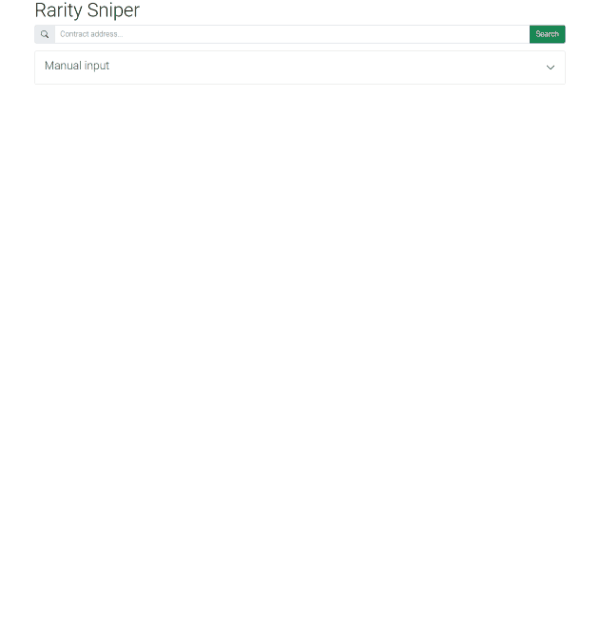

<h1 align="center">🔫 
  Rarity Sniping
</h1>
<h3 align="center">Quickly rank the NFTs in a collection by rarity</h3>

 

<h3 align="center"><a href="https://rarity-sniping.herokuapp.com/" target="_blank">Live preview</a></h3>

## 💬 About

This is the UI for an API (currently closed sourced) which calculates the rarities of the NFTs in a collection and ranks them. The UI allows a user to quickly search the rarity rank of a particular token id and look up sale information on OpenSea.

This app is primarily useful just after the metadata for an NFT collection is revealed. This is because other public rarity ranking websites take some time to update the ranks, time in which some buy/sell decisions can be made before the general market gets the same information (rarity sniping).

## 🚀 How to use

Simply enter the ETH address of the NFT contract you want to use and click search.

Some information about the collection will be displayed such as the total supply and the token uri (the metadata location). If the rarities have already been calculated they will be displayed (only the top 100 shown but all are available) and you will be able to search for token ids.

You can also force the recalculation if you think something has gone wrong.

The OpenSea section uses the OpenSea API to check whether the tokens in the rarity range provided are listed for sale.

e.g. if the range is 1 to 5 it will look up the 5 rarest NFTs in the collection

## ❓ How it works

The brain of the applications is really the API which supports a few different types of metadata (such as from json APIs, IPFS or in contract base64 encoded) and uses async http requests and threading to retrieve the metadata as fast as possible.

The API is not fool proof because of the wide variety of NFT contracts and metadata storage solutions so it might not work sometimes.

The algorithm used to calculate the rarities is based on [this rarity.tools article](https://raritytools.medium.com/ranking-rarity-understanding-rarity-calculation-methods-86ceaeb9b98c) and also uses trait normalization. [rarity.tools](https://rarity.tools/) is a popular NFT rarity ranking website.

Collection information is stored in Firebase after calculation. 

## ⚙ Tech

- React
- Bootstrap
- TypeScript
- Docker

## 📦 Deployment

Deployed on Heroku via Github.
The repo also contains setup to run on a VM on Docker.
